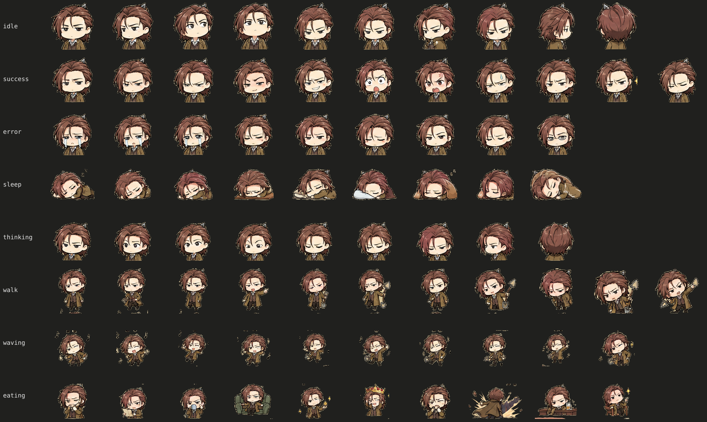

# pixel

A CLI that turns an AI-generated character sheet (a grid of poses on a flat background) into a DeskForge pet: a `spritesheet.webp` atlas and a `pet.json` that describes it.

The image model only has to draw the artwork. This tool removes the background, finds each frame, normalizes size and alignment, builds the atlas, writes the JSON, and validates the result.



## Setup

Requires Node.js 18+ and the `zip` command (used for packaging).

```bash
npm install
npm test
```

## Usage

### 1. Process a source image

```bash
node cli.js process \
  --source path/to/sheet.png \
  --pet-id lloyd \
  --display-name "Lloyd" \
  --description "A chibi adventurer in a long brown coat." \
  --row-map idle,success,error,sleep,thinking,walk,waving,eating
```

| Flag | Required | Meaning |
|---|---|---|
| `--source` | yes | Character sheet image. Each row of poses becomes one animation. |
| `--pet-id` | yes | Output folder name under `characters/`. |
| `--display-name` | no | Defaults to the pet id. |
| `--description` | no | Shown in DeskForge. |
| `--row-map` | no | Comma-separated animation name for each source row, top to bottom. Rows without a name fall back to the default order below. |
| `--clarity` | no | Resize filter: `pixel` (nearest-neighbour, default) or `crisp` (Lanczos). |
| `--out-dir` | no | Defaults to `characters`. |

Default animation order: `idle, walk, sleep, thinking, eating, waving, success, error`. A sheet can have at most 8 rows; any extra rows are dropped.

Output in `characters/<pet-id>/`:

- `spritesheet.webp`: the atlas DeskForge loads
- `spritesheet.png`: the same atlas as a PNG, for inspection
- `pet.json`: sprite layout and animations (row, frame count, fps, loop)
- `preview.png`: every animation row, labelled
- `source/source.png`: a copy of the input image

### 2. Preview the animations

```bash
npm run preview -- lloyd        # http://localhost:4173
```

### 3. Validate and package

```bash
node cli.js validate characters/lloyd
node cli.js package characters/lloyd   # writes character.zip (pet.json + spritesheet.webp, max 5 MB)
```

`validate` checks the required `pet.json` fields and that the atlas matches the declared grid. It also checks that unused cells are fully transparent and flags frames that touch a cell edge. `package` refuses to zip a character that fails validation.

## Layout

```
cli.js              process / validate / package commands
preview-server.js   local animated preview
src/                pipeline stages (background removal, frame detection,
                    normalization, atlas, JSON, preview, validator, packager)
test/               node:test suites
characters/         generated pets
```
